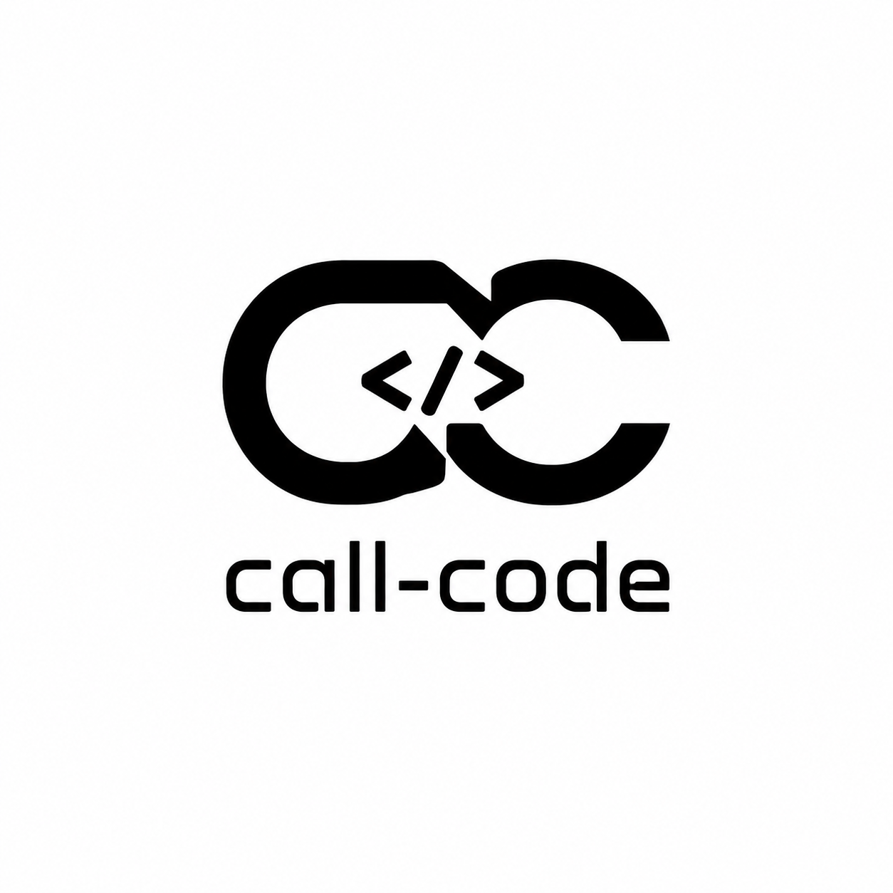

# call-code

<p align="center">
  
</p>


call-code 是一个本地运行的终端编程 Agent（CLI coding agent），基于 Node.js、TypeScript、Bun 和 Ink 构建。它可以在用户当前工作目录中接受自然语言任务，通过工具调用读取文件、写入文件、执行命令、搜索代码、查看环境信息，并结合本地短/长期记忆持续完成任务。

## 功能特性

- 终端交互界面：基于 Ink 的命令行界面，支持首页、对话、历史选择和相关页面预览。
- 双执行模式：`PLAN` 模式只允许生成计划和读取环境，`BUILD` 模式可以写入文件、执行命令并推进任务。
- 本地工具集：内置 `get_environment`、`read_file`、`write_file`、`search`、`bash`、`git_diff`、`ocr_image` 七个工具。
- 结构化响应协议：模型输出统一为 `tool_call` 或 `final` 的 JSON action，循环解析并继续执行。
- 本地记忆：短期记忆按任务保存，长期记忆按主题沉淀，仅在进程内使用，不写入本地 JSON。
- 上下文预算：运行时基于 token 估算对历史消息做裁剪，减少超出模型上下文的风险。
- 会话持久化：基于 Node 内置 `node:sqlite` 保存会话、条目、泳道、分支、记录、统计、事实和租约，默认写入 `.agent-sessions/sessions.db`。
- 会话客户端：`packages/client` 提供 React + Vite 会话界面，静态展示已停止，后续用于实时对话展示。

## 架构

```text
source/app.tsx                         CLI 层
   首页 / 对话 / 历史 / 相关页面预览
        │  用户输入、命令与活动面板操作
        ▼
agent-core/src/harness                核心层
├─ core/       agent、LLM 客户端与任务状态
├─ runtime/    runLoop 主循环、会话与工具运行时
├─ context/    构建上下文、历史摘要与 token 预算
├─ compaction/ 上下文压缩与分支摘要
├─ protocol/   解析 tool_call / final JSON action
├─ prompt/     系统提示词、工具说明与模式提示词
├─ tools/      七个本地工具，及 PLAN / BUILD 权限
│  └─ policy/  模式权限守卫
├─ session/    会话恢复、活动查询与任务会话
├─ memory/     短期 / 长期记忆（仅存内存，不落盘 JSON）
└─ utils/      shell 与文本截断等通用工具
        │  OpenAI chat.completions 请求（支持流式）
        ▼
OpenAI-compatible LLM                  模型层
        ▲
        │  返回 tool_call 或 final action
        └── 循环执行，直到任务完成
```

整体架构见交互式版本 [docs/index.html](docs/index.html)，可明暗主题切换、搜索、关系高亮与节点聚焦，直接在浏览器打开。`docs/index.html` 会由 GitHub Actions 发布到 `gh-pages` 分支。

运行时核心流程：

1. CLI 接收自然语言任务，交给 agent 构建上下文并调用 LLM。
2. 模型返回 `tool_call` 或 `final`，由 protocol 解析为结构化 action。
3. tools/policy 按 `PLAN` / `BUILD` 模式校验权限，允许后由对应工具执行。
4. 工具执行结果作为 observation 回写，memory 记录关键信息，循环继续，直到返回 `final`。

## 项目结构

```text
source/
  app.tsx                    # Ink CLI 入口与交互界面
packages/
  agent-core/                # 核心 agent、上下文、记忆、工具与协议实现
    src/
      harness/
        core/                # agent、LLM、任务状态
        runtime/             # runLoop、会话与工具运行时
        context/             # 上下文构建、摘要与 token 管理
        compaction/          # 上下文压缩与分支摘要
        memory/              # 短期/长期记忆存储与检索
        protocol/            # 模型 action/observation 协议解析
        prompt/              # 系统提示词、工具说明、模式提示词
        session/             # 会话恢复、活动查询与任务会话
        tools/               # 七个本地工具
        tools/policy/        # PLAN/BUILD 模式下的工具权限
        utils/               # shell 与文本截断等工具
      types/                 # 领域类型
      utils/                 # JSON、日志工具
      web/                   # 会话数据导出
  client/                    # TypeScript + React 会话界面客户端
  session-sqlite/            # 基于 node:sqlite 的会话历史与运行状态存储
tests/                        # 项目统一单元测试
 vitest.config.ts             # Vitest 测试配置
```

## 会话存储

会话历史由 `packages/session-sqlite` 持久化，默认数据库路径为 `.agent-sessions/sessions.db`。也可以通过 `SESSION_DB_PATH` 环境变量覆盖路径。数据层支持：

- 会话：会话元数据、父子会话和当前工作目录。
- 条目：用户、助手、工具和系统消息，支持泳道与分支。
- 记录与统计：运行记录、token 消耗、成本等统计信息。
- 事实与租约：供长任务复用的事实表，以及并发写入保护租约。

## 快速开始

1. 安装依赖（需要 Node.js 22.5+，包管理器为 Bun，版本固定为 1.3.11）。
2. 将 `.env.example` 复制为 `.env.local`，配置 `OPENAI_API_KEY` 与 `OPENAI_MODEL`；`.env` 与 `.env.local` 都会被加载。
3. 启动 CLI，入口为 `source/app.tsx`。

```bash
cp .env.example .env.local
bun install
bun dev
```

进入 CLI 后可以直接输入自然语言任务。CLI 默认按当前模式执行：`PLAN` 模式先生成计划，`BUILD` 模式直接参与文件读写和命令执行。计划生成后可用 Enter 确认执行，也可以继续补充修改意见。

## 环境变量

| 变量                  | 说明                                                                         |
| --------------------- | ---------------------------------------------------------------------------- |
| `OPENAI_API_KEY`      | 必填，OpenAI 兼容 API 的 Key。                                               |
| `OPENAI_API_BASE_URL` | 可选，自定义 OpenAI 兼容 base URL。                                          |
| `OPENAI_MODEL`        | 必填，模型名称，无默认值；未配置时 CLI 会提示。                              |
| `OPENAI_CONTEXT_WINDOW` | 可选，上下文窗口 token 数，默认 8000。                                     |
| `AGENT_DESKTOP_DIR`   | 可选，覆盖桌面目录路径，便于测试或自定义工作环境。                           |
| `SESSION_DB_PATH`     | 可选，SQLite 会话库文件路径，默认 `.agent-sessions/sessions.db`。            |
| `CALL_CODE_WEB_DATA`  | 可选，CLI 内 `/export` 的输出路径，默认 `packages/client/public/data.json`。 |

## CLI 命令与快捷键

```text
/help      查看命令与快捷键
/history   打开最近对话和相关页面选择
/pages     打开相关页面选择
/memory    查看 memory 概览
/status    查看当前 CLI 状态
/export    导出会话数据到 JSON 文件
/mode      查看当前模式和阶段
/plan      切换到 PLAN 模式
/build     切换到 BUILD 模式
/clear     清空当前聊天窗口
/home      返回首页并保留当前会话
/exit      结束当前会话并返回首页
```

快捷键：`Tab` 切换模式，`Ctrl+H` 打开历史选择，`Esc` 返回首页或退出选择，`Ctrl+C` 退出程序。

## 常用命令

以下命令与当前 CI 保持一致：

```bash
# 启动 CLI
bun dev

# 类型检查
bun run typecheck

# 类型检查（session-sqlite）
bun x tsc -p packages/session-sqlite/tsconfig.json --noEmit

# 类型检查客户端
bun run typecheck:client

# 运行全部测试（推荐）
bun run test

# 构建 agent-core
bun run build:agent-core

# 导出会话数据到 packages/client/public/data.json
bun run export:web

# 构建会话客户端（本地预览用）
bun run build:client
```

## 测试说明

测试文件统一放在项目根目录的 `tests/` 目录下，根目录的 `vitest.config.ts` 会统一收集并运行。

## License

MIT License，详见 [LICENSE](LICENSE)。
